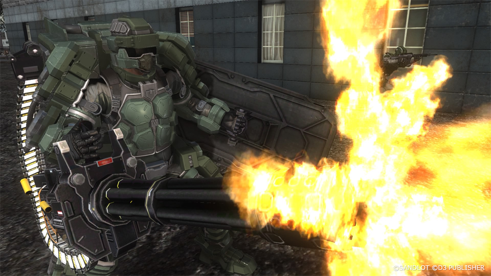
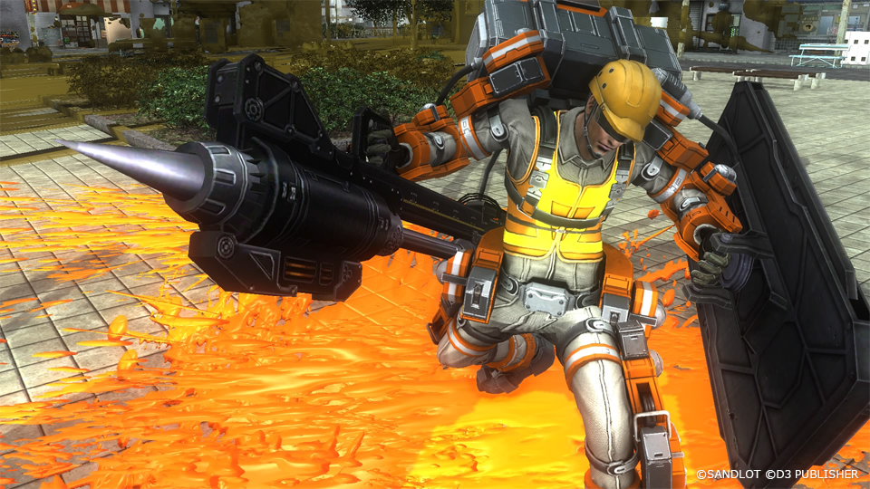

# Fencer

{ .banner-overlay .no-margin style="border-radius: 2%;" loading=lazy }

Soldiers who are equipped with military exoskeleton called the "Powered Skeleton".
With physical strengths exceeding 1 ton, they are capable of holding super-heavy firearms, effectively turning them into walking tanks.
They are known as "Fencers" because of their equipment weapon called the "Blast Hole Spear".

