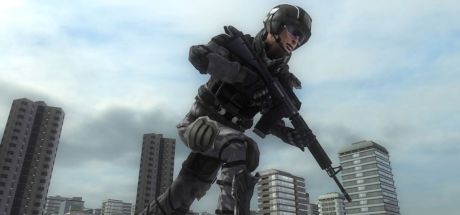
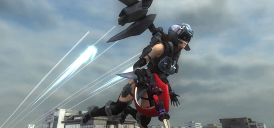
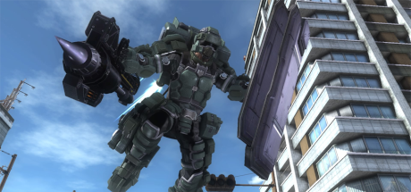

# Classes

  [{ .banner-overlay .no-margin style="border-radius: 2%;" loading=lazy }](ranger.md)

  [{ .banner-overlay .no-margin style="border-radius: 2%;" loading=lazy }](wing_diver.md)

  [{ .banner-overlay .no-margin style="border-radius: 2%;" loading=lazy }](fencer.md)

  [{ .banner-overlay .no-margin style="border-radius: 2%;" loading=lazy }](air_raider.md)

