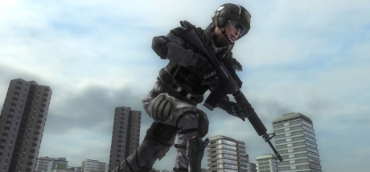

# Ranger

{ .banner-overlay .no-margin style="border-radius: 2%;" loading=lazy }

The generic name of the main infantry force of EDF.
Their specialty is in combat skills using variety of firearms.
Balanced in both offense and defense, they are the primary force for performing combat operations.

