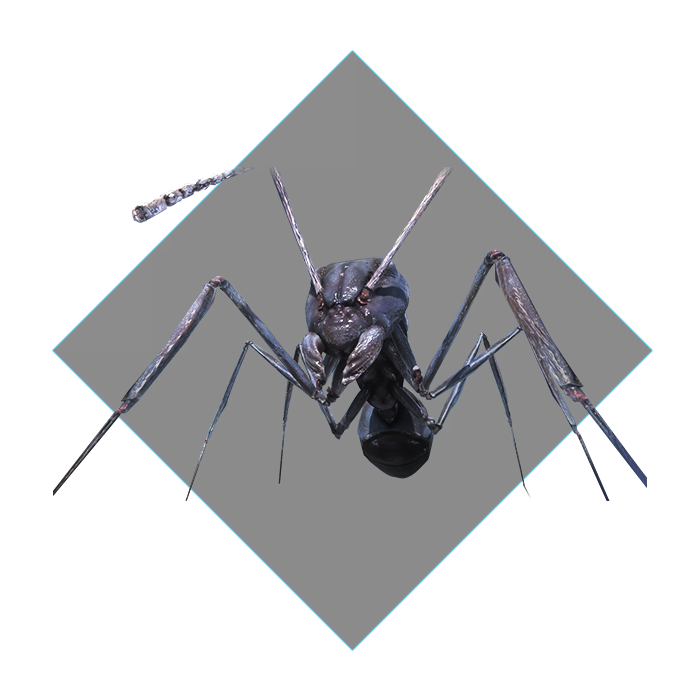
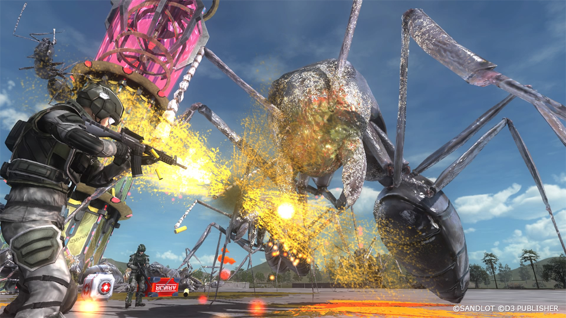
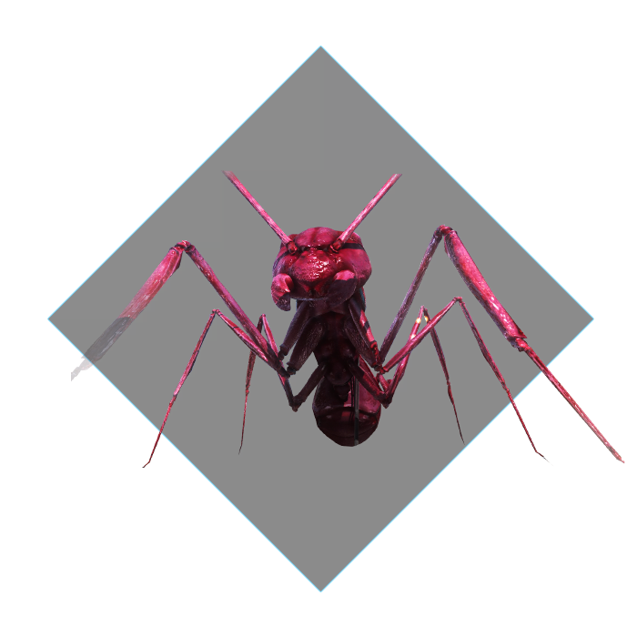
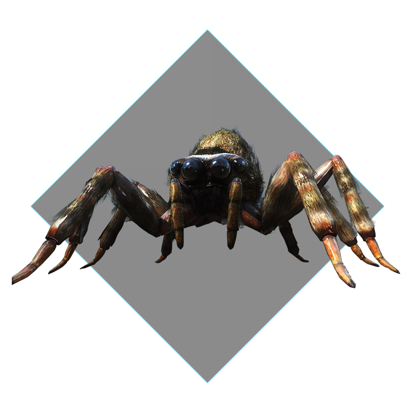
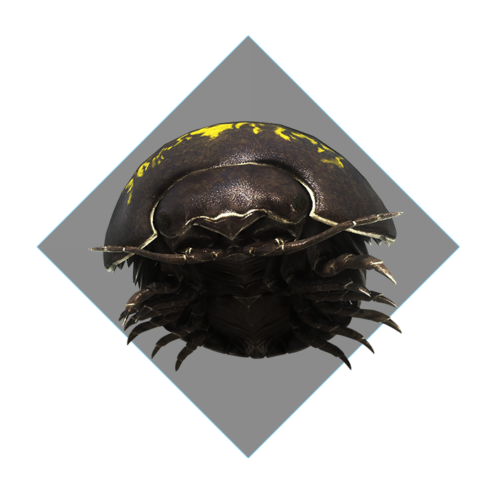
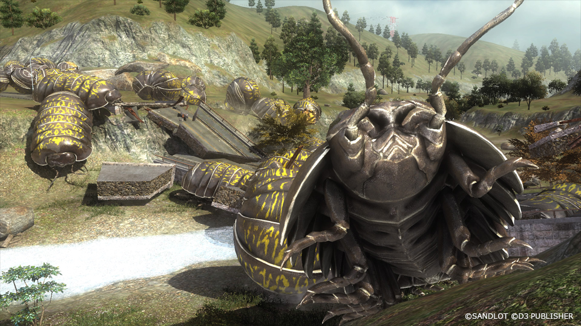

# Ground Forces

## Ant

<figure markdown>
  { .off-glb style="width: 50vh;"}
</figure>

Alien creatures brought in by the alien civilization known as Primers.  
Due to their highly aggressive nature towards native species, they were given the name "Aggressive Alien Species α" ("AASα" in short).  
Approximately 11 meters in total length. They are surprisingly agile, even though they are giant as the size of elephants.  
They're also capable of crawling up the walls vertically, with no visible decrease in speed.  
Their primary weapon is their big fangs, but the most dangerous weapon is their ability to spray strong acid.  
This acid can reach targets up to 100 meters away and people confirmed the metals melting within seconds.  

{ data-gallery="ant" }
{ data-gallery="ant" }

## Red Ant

Aggressive Alien Species α Type Red

<figure markdown>
  { .off-glb style="width: 50vh;"}
</figure>

They are thought to be a subspecies of AASα. Since they are huge in size and wrapped in a hard crust that can even repeal bullets, a strong firepower is required to exterminate them. But due to their inability to spray acid, they are not as hard to defeat. 

{ data-gallery="red-ant" }
{ data-gallery="red-ant" }
## Gold Ant

Aggressive Alien Species α Armor Mutant

Minim anim irure excepteur officia sint voluptate. Consequat laborum eu culpa commodo tempor est. Ipsum in laborum reprehenderit dolor reprehenderit. Ex id proident amet enim tempor elit cupidatat amet nisi occaecat eu. Ut ut reprehenderit consectetur eiusmod Lorem ipsum labore reprehenderit anim esse ea anim.

## Purple Ant

Do veniam nulla ad et aliqua ad officia elit in occaecat officia. Magna laborum mollit voluptate velit enim reprehenderit commodo consectetur quis qui proident ea. Esse eu sit nulla fugiat eu dolore do ullamco cupidatat voluptate consequat aliqua ea adipisicing. Anim aliquip laborum dolor Lorem velit. Deserunt qui fugiat cillum eu consectetur exercitation officia dolore aliquip.

## Green Ant

Et velit nisi quis ullamco. Magna ipsum magna sunt ut ea commodo tempor veniam non do. Sint ea consequat veniam enim deserunt. Amet eu officia laboris exercitation dolore.

## Spider

Aggressive Alien Species β

<figure markdown>
  { .off-glb style="width: 50vh;"}
</figure>

They are code named "Aggressive Alien Species β" ("AASβ" in short). Even though they were thought to be far less agile than "AASα", the troop which fought with them were heavily damaged. Therefore, they seem to possess high combat capabilities after all.

{ data-gallery="spider" }
{ data-gallery="spider" }

## Silver Spider

Eiusmod eu est eiusmod proident Lorem laborum excepteur cupidatat laboris et anim laboris eiusmod. Do velit commodo esse sunt esse ea laborum consectetur id Lorem. Ex labore do reprehenderit anim consequat.

## Roller

Aggressive Alien Species γ

<figure markdown>
  { .off-glb style="width: 50vh;"}
</figure>

A third type of aggressors brought in by the aliens (Primers?). They are code named "AASγ".
Since they move very slow, at first they appear to be of no threat. But they are capable of extremely dangerous and effective attacks that utilize their enormous body. They roll themselves up into a sphere and start crushing everything which appear in their path.
Fortunately, since our weapons can penetrate their exoskeleton, to exterminate them is not considered impossible.

{ data-gallery="roller" }
{ data-gallery="roller" }