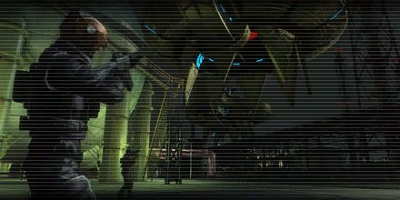

# Attacking the Fleet

<figure markdown>
  
</figure>

A fleet of teleportation ships has invaded the industrial area. They stay still and low in the sky. They show no signs of activity.

We must shoot them down before they attack. But the operation mysterious monsters is on the go, more than half of the troops are away from the base, so our fighting force is very limited. We will launch a night raid with only a few soldiers.
Use the night as cover to approach and ambush the teleportation ships.
