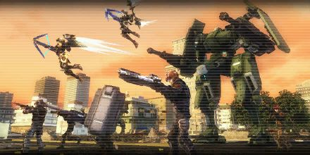

# Bloody Battle

<figure markdown>
  
</figure>

The enemy infantry begins to strike. Those aliens lead the monsters, forming a devastating legion. We intend to deploy forces in urban areas on the enemy's path and confront them.

Confronting them isn't the best plan, but our combat strength is low and we can't defend a wide area. We can only assemble the remaining force and hit the aliens hard. That's the only way to protect this region.
It will be a tough battle. I'll pray for you.
