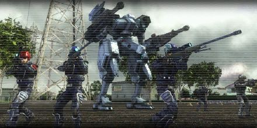

# Fighters Ambush

<figure markdown>
  
</figure>

Mothership no.2 continues to launch battle robots and a lot of them are being dropped in the area. Those robots attack without mercy, turning the city into debris.
To prevent damages from spreading, we'll ambush the robots on their planned route. Powered exoskeletons will join the force to shoot them down. Infantry unit, cover the powered exoskeletons.
