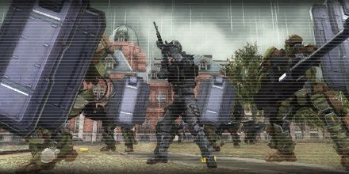

# Iron Wall

<figure markdown>
  
</figure>

A large number of aliens are approaching. We're supposed to avoid direct confrontation, but the evacuation progress in the city is falling behind schedule. We must stop them or they'll cause the city significant harm.
We will form a protective wall and prevent the enemy from invading. This is the only way.

This operation is called Iron Wall.
Let's deploy in the areas that have completed evacuation. We will shield the citizens off from the enemy infantry.
