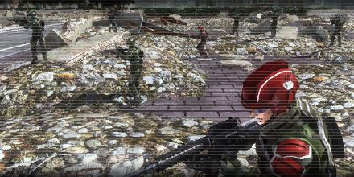

# Reinvasion

<figure markdown>
  
</figure>

The enemy attacked the city. We defeated them after a fierce battle, but the city was left in ruins. Our troops were worn out, so the garrison had to retreat temporarily; however, the aliens are on the verge of mounting another attack.

All units that can fight head out and engage.
