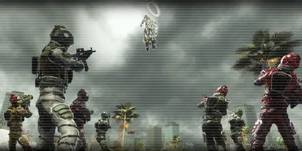

# The Nameless

<figure markdown>
  
</figure>

The Primer's attack has stopped everywhere in the world. The ship that we shot down was actually the enemy's flagship. A lost cause turned into a surprise victory for humanity.
But wait?!
A living entity in human form appears from the enemy ship. What on earth is going on?
It doesn't seem armed though. Infantry unit approach and capture the entity. If it resists, you have permission to shoot and kill.
