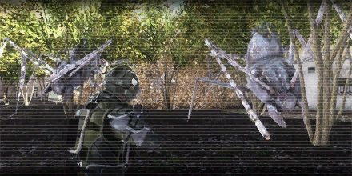
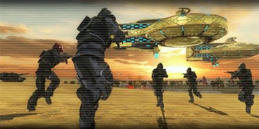
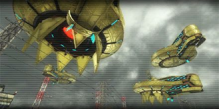
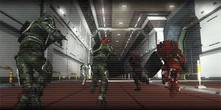
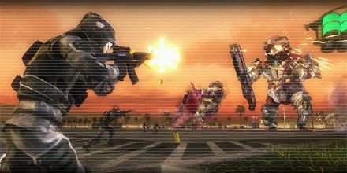
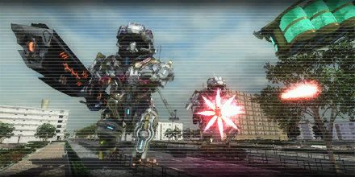
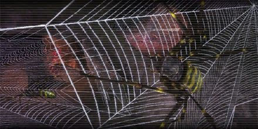
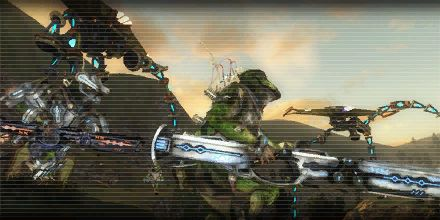
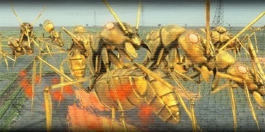
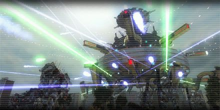

# Missions

## 0. Engage Aggressors 1

<figure markdown>
  [{ .off-glb style="width: 65vh;" loading=lazy }](engage_aggressors_1.md)
</figure>

## 1. Engage Aggressors 2

<figure markdown>
  [{ .off-glb style="width: 65vh;" loading=lazy }](engage_aggressors_2.md)
</figure>

## 2. Airborne Enemies

<figure markdown>
  [{ .off-glb style="width: 65vh;" loading=lazy }](airborne_enemies.md)
</figure>

## 3. Reclaim Base 236

<figure markdown>
  [{ .off-glb style="width: 65vh;" loading=lazy }](reclaim_base_236.md)
</figure>

## 4. Infiltrate Base 236

<figure markdown>
  [{ .off-glb style="width: 65vh;" loading=lazy }](infiltrate_base_236.md)
</figure>

## 5. Defend Base 236

<figure markdown>
  [{ .off-glb style="width: 65vh;" loading=lazy }](defend_base_236.md)
</figure>

## 6. Engage Teleportation Anchors 1

<figure markdown>
  [{ .off-glb style="width: 65vh;" loading=lazy }](engage_teleportation_anchors_1.md)
</figure>

## 7. Engage Aliens 1

<figure markdown>
  [{ .off-glb style="width: 65vh;" loading=lazy }](engage_aliens_1.md)
</figure>

## 8. Engage Aggressors 3

<figure markdown>
  [{ .off-glb style="width: 65vh;" loading=lazy }](engage_aggressors_3.md)
</figure>

## 9. Engage Aliens 2

<figure markdown>
  [{ .off-glb style="width: 65vh;" loading=lazy }](engage_aliens_2.md)
</figure>

## 10. Underground 1

<figure markdown>
  [{ .off-glb style="width: 65vh;" loading=lazy }](underground_1.md)
</figure>

## 11. Underground 2

<figure markdown>
  [{ .off-glb style="width: 65vh;" loading=lazy }](underground_2.md)
</figure>

## 12. Engage Aliens 3

<figure markdown>
  [{ .off-glb style="width: 65vh;" loading=lazy }](engage_aliens_3.md)
</figure>

## 13. Engage Aggressors 4

<figure markdown>
  [{ .off-glb style="width: 65vh;" loading=lazy }](engage_aggressors_4.md)
</figure>

## 14. Engage Outpost Base

<figure markdown>
  [{ .off-glb style="width: 65vh;" loading=lazy }](engage_outpost_base.md)
</figure>

