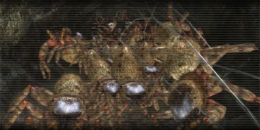

# Missions

!!! info

    In the future, the enemy types appearing in each mission will be listed below it. In addition, the border of the image should indicate the felt difficulty of the mission. I would also like to classify the duration of individual missions, but so far, I have no idea how this could ideally be integrated into the design.

## 0. Engage Aggressors 1

[{ .banner-overlay .mission-easy .banner-overlay style="width: 630px;" loading=lazy }](engage_aggressors_1.md)

## 1. Engage Aggressors 2

[{ .banner-overlay .mission-easy .banner-overlay style="width: 630px;" loading=lazy }](engage_aggressors_2.md)

## 2. Airborne Enemies

[{ .banner-overlay .mission-easy .banner-overlay style="width: 630px;" loading=lazy }](airborne_enemies.md)

## 3. Reclaim Base 236

[{ .banner-overlay .mission-easy .banner-overlay style="width: 630px;" loading=lazy }](reclaim_base_236.md)

## 4. Infiltrate Base 236

[{ .banner-overlay .mission-easy .banner-overlay style="width: 630px;" loading=lazy }](infiltrate_base_236.md)

## 5. Defend Base 236

[{ .banner-overlay .mission-easy .banner-overlay style="width: 630px;" loading=lazy }](defend_base_236.md)

## 6. Engage Teleportation Anchors 1

[{ .banner-overlay .mission-easy .banner-overlay style="width: 630px;" loading=lazy }](engage_teleportation_anchors_1.md)

## 7. Engage Aliens 1

[{ .banner-overlay .mission-easy .banner-overlay style="width: 630px;" loading=lazy }](engage_aliens_1.md)

## 8. Engage Aggressors 3

[{ .banner-overlay .mission-easy .banner-overlay style="width: 630px;" loading=lazy }](engage_aggressors_3.md)

## 9. Engage Aliens 2

[{ .banner-overlay .mission-easy .banner-overlay style="width: 630px;" loading=lazy }](engage_aliens_2.md)

## 10. Underground 1

[{ .banner-overlay .mission-easy .banner-overlay style="width: 630px;" loading=lazy }](underground_1.md)

## 11. Underground 2

[{ .banner-overlay .mission-easy .banner-overlay style="width: 630px;" loading=lazy }](underground_2.md)

## 12. Engage Aliens 3

[{ .banner-overlay .mission-easy .banner-overlay style="width: 630px;" loading=lazy }](engage_aliens_3.md)

## 13. Engage Aggressors 4

[{ .banner-overlay .mission-easy .banner-overlay style="width: 630px;" loading=lazy }](engage_aggressors_4.md)

## 14. Engage Outpost Base

[{ .banner-overlay .mission-easy .banner-overlay style="width: 630px;" loading=lazy }](engage_outpost_base.md)
