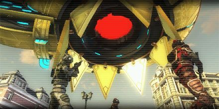
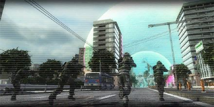
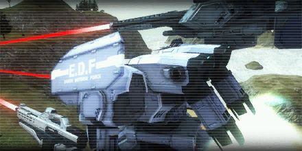
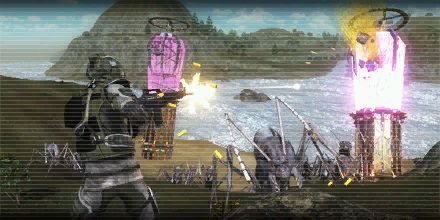
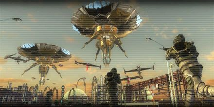
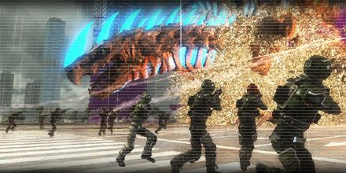
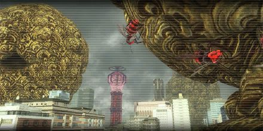
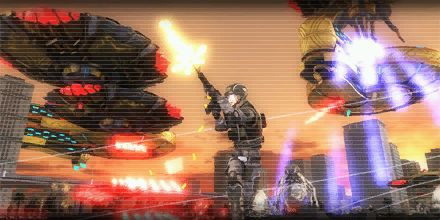

# Missions

!!! info

    In the future, the enemy types appearing in each mission will be listed below it. In addition, the border of the image should indicate the felt difficulty of the mission. I would also like to classify the duration of individual missions, but so far, I have no idea how this could ideally be integrated into the design.

## 0. Engage Teleportation Ships

[{ .banner-overlay .mission-easy .banner-overlay style="width: 630px;" loading=lazy }](engage_teleportation_ships.md)

## 1. Engage Aliens 4

[{ .banner-overlay .mission-easy .banner-overlay style="width: 630px;" loading=lazy }](engage_aliens_4.md)

## 2. Engage Drones

[{ .banner-overlay .mission-easy .banner-overlay style="width: 630px;" loading=lazy }](engage_drones.md)

## 3. Engage Alien Troops 1

[{ .banner-overlay .mission-easy .banner-overlay style="width: 630px;" loading=lazy }](engage_alien_troops_1.md)

## 4. Engage Teleportation Anchors 2

[{ .banner-overlay .mission-easy .banner-overlay style="width: 630px;" loading=lazy }](engage_teleportation_anchors_2.md)

## 5. Underground 3

[{ .banner-overlay .mission-easy .banner-overlay style="width: 630px;" loading=lazy }](underground_3.md)

## 6. Engage Aliens 5

[{ .banner-overlay .mission-easy .banner-overlay style="width: 630px;" loading=lazy }](engage_aliens_5.md)

## 7. Engage Aggressors 5

[{ .banner-overlay .mission-easy .banner-overlay style="width: 630px;" loading=lazy }](engage_aggressors_5.md)

## 8. Engage Teleportation Anchors 3

[{ .banner-overlay .mission-easy .banner-overlay style="width: 630px;" loading=lazy }](engage_teleportation_anchors_3.md)

## 9. Engage Alien Troops 2

[{ .banner-overlay .mission-easy .banner-overlay style="width: 630px;" loading=lazy }](engage_alien_troops_2.md)

## 10. Engage Mysterious Monster

[{ .banner-overlay .mission-easy .banner-overlay style="width: 630px;" loading=lazy }](engage_mysterious_monster.md)

## 11. The Last Stand 1

[{ .banner-overlay .mission-easy .banner-overlay style="width: 630px;" loading=lazy }](the_last_stand_1.md)

## 12. The Last Stand 2

[{ .banner-overlay .mission-easy .banner-overlay style="width: 630px;" loading=lazy }](the_last_stand_2.md)

## 13. The Last Stand 3

[{ .banner-overlay .mission-easy .banner-overlay style="width: 630px;" loading=lazy }](the_last_stand_3.md)
