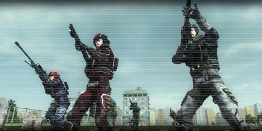

## Attack of the Flying Fleet

<figure markdown>
  { loading=lazy }
</figure>

> An army of flying objects is attacking the city. They keep striking, gradually turning it into ruins.
> Wait on the projected path and attack the flying objects. We don't have enough combat strength, so we'll depend on the infantry unit.
