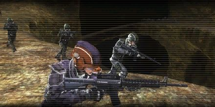

# Cave Invasion Stage 2

<figure markdown>

</figure>

The scout found a giant chasm.
In order to continue to the deep end, we have to reach the bottom of the chasm. The problem is how...Fortunately, there's an earth-rock passageway in the form of a bridge reaching across the chasm. It's very narrow and dangerous, but it's still possible to get through.

Operation Stage 2, the elite team will go across the narrow bridge and reach the bottom of the chasm to secure the area.
Since the passageway is too narrow for an army to get through, we have to count on a few elites to complete the mission. Details of the route has been sent to the team leader. Please follow the instruction and act as a team.
