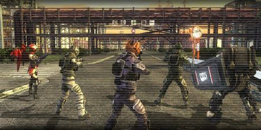

# Defeat Archelus

<figure markdown>

</figure>

We have finished Barga's maintenance. Next we're going to eliminate Archelus.
We've calculated Archlus' moving path and we have decided the strike zone accordingly. All units head to the scene. If Barga arrives late, make sure you stop Archelus from moving on.

Barga is being carried by a transport aircraft. Since Barga has poor mobility, we'll try to drop it as close to Archelus as possible.
