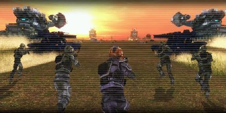

# Greatest Final Confrontation

<figure markdown>

</figure>

A large alien army is approaching. They not only come in an unprecedented scale, but bring along several Erginuses. They are determined to end this war.
It's time for the showdown. With our limited battle force, we should have avoided direct confrontation, but we've got the final trump card especially prepared for this moment.
I present to you the mobile cranes adapted for battle War Bargas. All of them will be deployed to eliminate Erginuses. If we lose this battle, we lose our future. We also plan to deploy as many EMCs and railguns as possible. Win by all means necessary.
