# Missions

## 0. **Today's schedule**

<figure markdown>
  [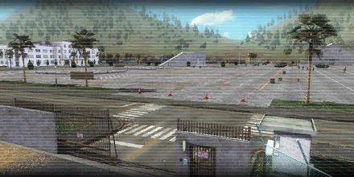{ .off-glb loading=lazy }](today's_schedule.md)
</figure>

## 1. Escape From Darkness

<figure markdown>
  [{ .off-glb loading=lazy }](escape_from_darkness.md)
</figure>

## 2. Crisis in Base 228: Part 1

<figure markdown>
  [{ .off-glb loading=lazy }](crisis_in_base_228_part_1.md)
</figure>

## 3. Crisis in Base 228: Part 2

<figure markdown>
  [{ .off-glb loading=lazy }](crisis_in_base_228_part_2.md)
</figure>

## 4. Shattered peace

<figure markdown>
  [{ .off-glb loading=lazy }](shattered_peace.md)
</figure>

## 5. Unidentified Flying Objects

<figure markdown>
  [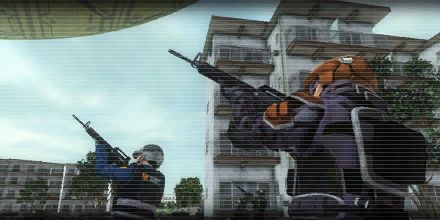{ .off-glb loading=lazy }](unidentified_flying_objects.md)
</figure>

## 6. The Quiet Threat

<figure markdown>
  [{ .off-glb loading=lazy }](the_quiet_threat.md)
</figure>

## 7. Monsters Attack!

<figure markdown>
  [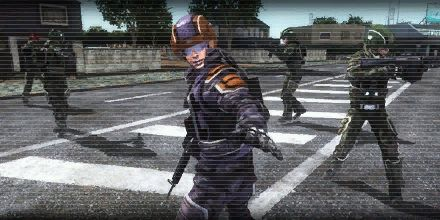{ .off-glb loading=lazy }](monsters_attack.md)
</figure>

## 8. Wedge of Destruction

<figure markdown>
  [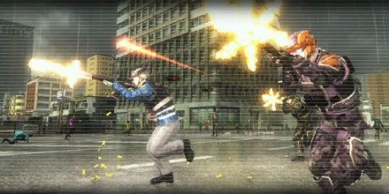{ .off-glb loading=lazy }](wedge_of_destruction.md)
</figure>

## 9. Escape

<figure markdown>
  [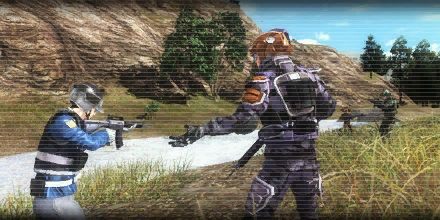{ .off-glb loading=lazy }](escape.md)
</figure>

## 10. Burning Sky

<figure markdown>
  [{ .off-glb loading=lazy }](burning_sky.md)
</figure>

## 11. Spreading Disaster

<figure markdown>
  [{ .off-glb loading=lazy }](spreading_disaster.md)
</figure>

## 12. Turning Point

<figure markdown>
  [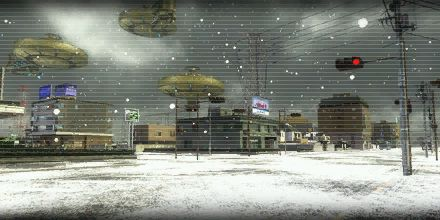{ .off-glb loading=lazy }](turning_point.md)
</figure>

## 13. Extermination

<figure markdown>
  [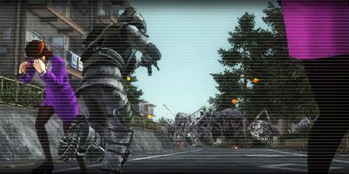{ .off-glb loading=lazy }](extermination.md)
</figure>

## 14. Destroy the Giant Ship

<figure markdown>
  [{ .off-glb loading=lazy }](destroy_the_giant_ship.md)
</figure>

## 15. Isolation

<figure markdown>
  [{ .off-glb loading=lazy }](isolation.md)
</figure>

## 16. Mastermind Revealed

<figure markdown>
  [{ .off-glb loading=lazy }](mastermind_revealed.md)
</figure>

## 17. Secret of the Cave

<figure markdown>
  [{ .off-glb loading=lazy }](secret_of_the_cave.md)
</figure>

## 18. Eradication Plan

<figure markdown>
  [{ .off-glb loading=lazy }](eradication_plan.md)
</figure>

## 19. Encounters on Return

<figure markdown>
  [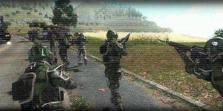{ .off-glb loading=lazy }](encounters_on_return.md)
</figure>

## 20. Surprise Attack at Night

<figure markdown>
  [{ .off-glb loading=lazy }](surprise_attack_at_night.md)
</figure>

## 21. Scouting the Outpost

<figure markdown>
  [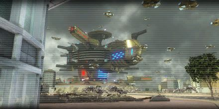{ .off-glb loading=lazy }](scouting_the_outpost.md)
</figure>

## 22. Mountain of Wedges

<figure markdown>
  [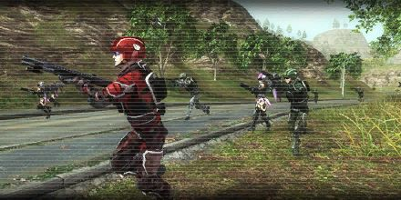{ .off-glb loading=lazy }](mountain_of_wedges.md)
</figure>

## 23. The Landing Ships

<figure markdown>
  [{ .off-glb loading=lazy }](the_landing_ships.md)
</figure>

## 24. Reinvasion

<figure markdown>
  [{ .off-glb loading=lazy }](reinvasion.md)
</figure>

## 25. Artillery Unit

<figure markdown>
  [{ .off-glb loading=lazy }](artillery_unit.md)
</figure>

## 26. Sniper Team

<figure markdown>
  [{ .off-glb loading=lazy }](sniper_team.md)
</figure>

## 27. Red Drones

<figure markdown>
  [{ .off-glb loading=lazy }](red_drones.md)
</figure>

## 28. Iron Wall

<figure markdown>
  [{ .off-glb loading=lazy }](iron_wall.md)
</figure>

## 29. Destroy the Outpost: Plan A

<figure markdown>
  [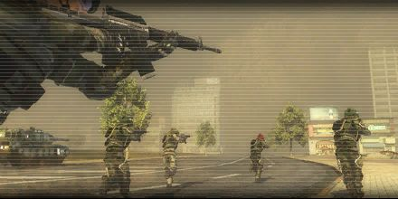{ .off-glb loading=lazy }](destroy_the_outpost_plan_a.md)
</figure>

## 30. Destroy the Outpost: Plan B

<figure markdown>
  [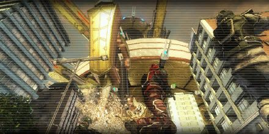{ .off-glb loading=lazy }](destroy_the_outpost_plan_b.md)
</figure>

## 31. Cave Invasion Stage 1

<figure markdown>
  [{ .off-glb loading=lazy }](cave_invasion_stage_1.md)
</figure>

## 32. Cave Invasion Stage 2

<figure markdown>
  [{ .off-glb loading=lazy }](cave_invasion_stage_2.md)
</figure>

## 33. Cave Invasion Final Stage

<figure markdown>
  [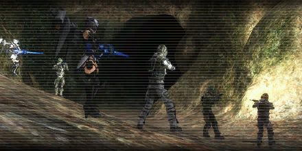{ .off-glb loading=lazy }](cave_invasion_final_stage.md)
</figure>

## 34. Berth

<figure markdown>
  [{ .off-glb loading=lazy }](berth.md)
</figure>

## 35. Flying Killers

<figure markdown>
  [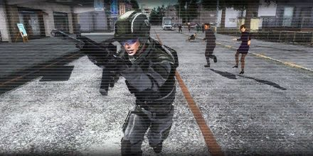{ .off-glb loading=lazy }](flying_killers.md)
</figure>

## 36. Monster Elimination Plan

<figure markdown>
  [{ .off-glb loading=lazy }](monster_elimination_plan.md)
</figure>

## 37. Plain of Conflict

<figure markdown>
  [{ .off-glb loading=lazy }](plain_of_conflict.md)
</figure>

## 38. Current Headquarters

<figure markdown>
  [{ .off-glb loading=lazy }](current_headquarters.md)
</figure>

## 39. Brutal Battlefield

<figure markdown>
  [{ .off-glb loading=lazy }](brutal_battlefield.md)
</figure>

## 40. Assaulting the Outpost

<figure markdown>
  [{ .off-glb loading=lazy }](assaulting_the_outpost.md)
</figure>

## 41. Saving Europe: Operation 1

<figure markdown>
  [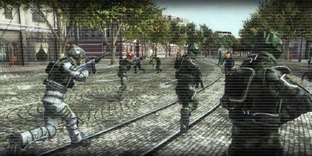{ .off-glb loading=lazy }](saving_europe_operation_1.md)
</figure>

## 42. Saving Europe: Operation 2

<figure markdown>
  [{ .off-glb loading=lazy }](saving_europe_operation_2.md)
</figure>

## 43. Culling the Flying Type

<figure markdown>
  [{ .off-glb loading=lazy }](culling_the_flying-type.md)
</figure>

## 44. Circle Formation

<figure markdown>
  [{ .off-glb loading=lazy }](circle_formation.md)
</figure>

## 45. Giant Ship Attack : 2nd Attempt

<figure markdown>
  [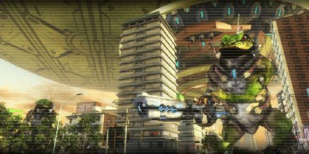{ .off-glb loading=lazy }](giant_ship_attack__2nd_attempt.md)
</figure>

## 46. Survivors

<figure markdown>
  [{ .off-glb loading=lazy }](survivors.md)
</figure>

## 47. The Flying Saucers

<figure markdown>
  [{ .off-glb loading=lazy }](the_flying_saucers.md)
</figure>

## 48. Airborne Fighters: Part 1

<figure markdown>
  [{ .off-glb loading=lazy }](airborne_fighters_part_1.md)
</figure>

## 49. Airborne Fighters: Part 2

<figure markdown>
  [{ .off-glb loading=lazy }](airborne_fighters_part_2.md)
</figure>

## 50. Attacking the Fleet

<figure markdown>
  [{ .off-glb loading=lazy }](attacking_the_fleet.md)
</figure>

## 51. Underground Trap

<figure markdown>
  [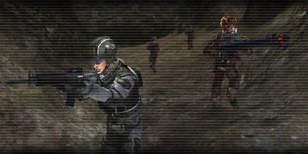{ .off-glb loading=lazy }](underground_trap.md)
</figure>

## 52. The Army Group Raid

<figure markdown>
  [{ .off-glb loading=lazy }](the_army_group_raid.md)
</figure>

## 53. Wire-puller

<figure markdown>
  [{ .off-glb loading=lazy }](wire-puller.md)
</figure>

## 54. Hiding Behind the Web

<figure markdown>
  [{ .off-glb loading=lazy }](hiding_behind_the_web.md)
</figure>

## 55. Predators on Thread

<figure markdown>
  [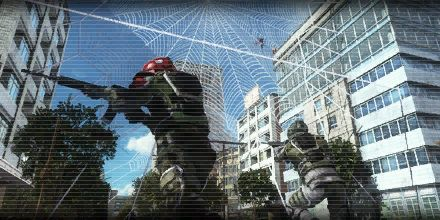{ .off-glb loading=lazy }](predators_on_thread.md)
</figure>

## 56. Scuffle in the City

<figure markdown>
  [{ .off-glb loading=lazy }](scuffle_in_the_city.md)
</figure>

## 57. Hidden Threat

<figure markdown>
  [{ .off-glb loading=lazy }](hidden_threat.md)
</figure>

## 58. Break the Barrier

<figure markdown>
  [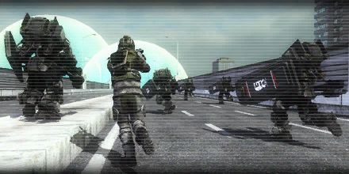{ .off-glb loading=lazy }](break_the_barrier.md)
</figure>

## 59. Mountain Investigation

<figure markdown>
  [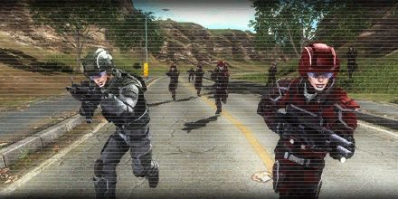{ .off-glb loading=lazy }](mountain_investigation.md)
</figure>

## 60. Destroying Large Flying Saucers

<figure markdown>
  [{ .off-glb loading=lazy }](destroying_large_flying_saucers.md)
</figure>

## 61. Sweeping Monster Balls

<figure markdown>
  [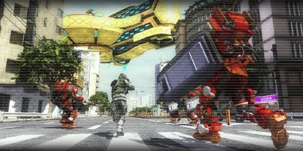{ .off-glb loading=lazy }](sweeping_monster_balls.md)
</figure>

## 62. Recapturing the Industrial Area

<figure markdown>
  [{ .off-glb loading=lazy }](recapturing_the_industrial_area.md)
</figure>

## 63. Winged Legion

<figure markdown>
  [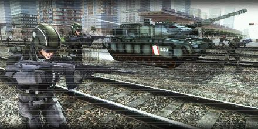{ .off-glb loading=lazy }](winged_legion.md)
</figure>

## 64. Landing Giant Ship

<figure markdown>
  [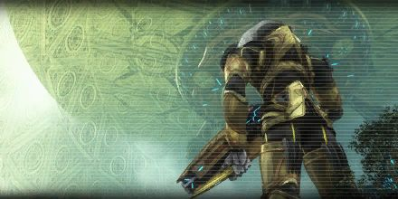{ .off-glb loading=lazy }](landing_giant_ship.md)
</figure>

## 65. Falling Monster Balls

<figure markdown>
  [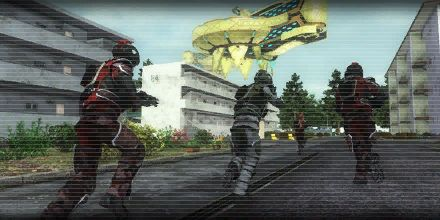{ .off-glb loading=lazy }](falling_monster_balls.md)
</figure>

## 66. Extraterrestrial Riders

<figure markdown>
  [{ .off-glb loading=lazy }](extraterrestrial_riders.md)
</figure>

## 67. Crashing Giant Pylons

<figure markdown>
  [{ .off-glb loading=lazy }](crashing_giant_pylons.md)
</figure>

## 68. Enormous Mutants

<figure markdown>
  [{ .off-glb loading=lazy }](enormous_mutants.md)
</figure>

## 69. Aircrafts

<figure markdown>
  [{ .off-glb loading=lazy }](aircrafts.md)
</figure>

## 70. Anchors Destruction Plan

<figure markdown>
  [{ .off-glb loading=lazy }](anchors_destruction_plan.md)
</figure>

## 71. Battle in the Fog

<figure markdown>
  [{ .off-glb loading=lazy }](battle_in_the_fog.md)
</figure>

## 72. Light Defenses

<figure markdown>
  [{ .off-glb loading=lazy }](light_defenses.md)
</figure>

## 73. Flying Unit

<figure markdown>
  [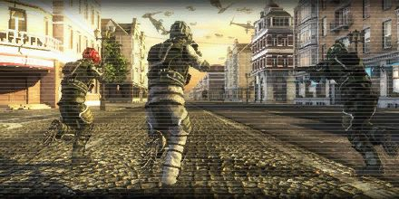{ .off-glb loading=lazy }](flying_unit.md)
</figure>

## 74. Fighters Ambush

<figure markdown>
  [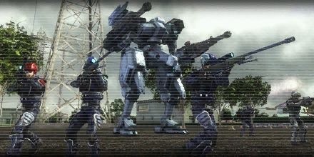{ .off-glb loading=lazy }](fighters_ambush.md)
</figure>

## 75. Sieged City

<figure markdown>
  [{ .off-glb loading=lazy }](sieged_city.md)
</figure>

## 76. Doomed Queens

<figure markdown>
  [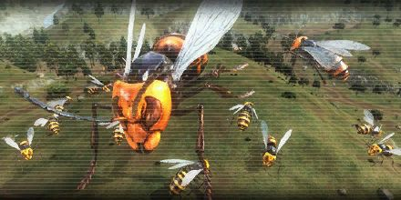{ .off-glb loading=lazy }](doomed_queens.md)
</figure>

## 77. Monster Extermination

<figure markdown>
  [{ .off-glb loading=lazy }](monster_extermination.md)
</figure>

## 78. Reclaiming Base 228: Stage 1

<figure markdown>
  [{ .off-glb loading=lazy }](reclaiming_base_228_stage_1.md)
</figure>

## 79. Reclaiming Base 228: Stage 2

<figure markdown>
  [{ .off-glb loading=lazy }](reclaiming_base_228_stage_2.md)
</figure>

## 80. Reclaiming Base 228: Stage 3

<figure markdown>
  [{ .off-glb loading=lazy }](reclaiming_base_228_stage_3.md)
</figure>

## 81. Reclaiming Base 228: Retreat

<figure markdown>
  [{ .off-glb loading=lazy }](reclaiming_base_228_retreat.md)
</figure>

## 82. Defeat Archelus

<figure markdown>
  [{ .off-glb loading=lazy }](defeat_archelus.md)
</figure>

## 83. City of Giant Pylons

<figure markdown>
  [{ .off-glb loading=lazy }](city_of_giant_pylons.md)
</figure>

## 84. Incoming Larvae

<figure markdown>
  [{ .off-glb loading=lazy }](incoming_larvae.md)
</figure>

## 85. Secret in the Dark

<figure markdown>
  [{ .off-glb loading=lazy }](secret_in_the_dark.md)
</figure>

## 86. Approaching Monster Balls

<figure markdown>
  [{ .off-glb loading=lazy }](approaching_monster_balls.md)
</figure>

## 87. Threads Everywhere

<figure markdown>
  [{ .off-glb loading=lazy }](threads_everywhere.md)
</figure>

## 88. Flying-type Extermination

<figure markdown>
  [{ .off-glb loading=lazy }](flying-type_extermination.md)
</figure>

## 89. Broken Land

<figure markdown>
  [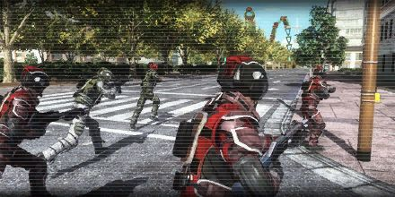{ .off-glb loading=lazy }](broken_land.md)
</figure>

## 90. Sparkling Abyss

<figure markdown>
  [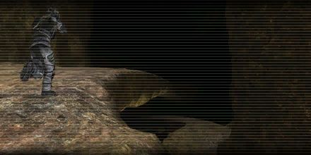{ .off-glb loading=lazy }](sparkling_abyss.md)
</figure>

## 91. Attack of the Flying Fleet

<figure markdown>
  [{ .off-glb loading=lazy }](attack_of_the_flying_fleet.md)
</figure>

## 92. Mountain Traps

<figure markdown>
  [{ .off-glb loading=lazy }](mountain_traps.md)
</figure>

## 93. Bloody Battle

<figure markdown>
  [{ .off-glb loading=lazy }](bloody_battle.md)
</figure>

## 94. Drop Location

<figure markdown>
  [{ .off-glb loading=lazy }](drop_location.md)
</figure>

## 95. Land of Monsters

<figure markdown>
  [{ .off-glb loading=lazy }](land_of_monsters.md)
</figure>

## 96. Steel Covered by Threads

<figure markdown>
  [{ .off-glb loading=lazy }](steel_covered_by_threads.md)
</figure>

## 97. Coastal Defense Line

<figure markdown>
  [{ .off-glb loading=lazy }](coastal_defense_line.md)
</figure>

## 98.  Intense Battle Underground

<figure markdown>
  [{ .off-glb loading=lazy }](intense_battle_underground.md)
</figure>

## 99. Greatest Final Confrontation

<figure markdown>
  [{ .off-glb loading=lazy }](greatest_final_confrontation.md)
</figure>

## 100. Crumbling city

<figure markdown>
  [{ .off-glb loading=lazy }](crumbling_city.md)
</figure>

## 101. Forced Entry

<figure markdown>
  [{ .off-glb loading=lazy }](forced_entry.md)
</figure>

## 102. Tornado

<figure markdown>
  [{ .off-glb loading=lazy }](tornado.md)
</figure>

## 103. Against All Odds

<figure markdown>
  [{ .off-glb loading=lazy }](against_all_odds.md)
</figure>

## 104. Monster Banquet

<figure markdown>
  [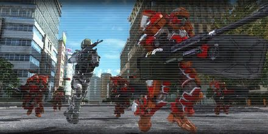{ .off-glb loading=lazy }](monster_banquet.md)
</figure>

## 105. Suicide Squad

<figure markdown>
  [{ .off-glb loading=lazy }](suicide_squad.md)
</figure>

## 106. Invader Assembly

<figure markdown>
  [{ .off-glb loading=lazy }](invader_assembly.md)
</figure>

## 107. Scorched Earth

<figure markdown>
  [{ .off-glb loading=lazy }](scorched_earth.md)
</figure>

## 108. Despair

<figure markdown>
  [{ .off-glb loading=lazy }](despair.md)
</figure>

## 109. Under Siege

<figure markdown>
  [{ .off-glb loading=lazy }](under_siege.md)
</figure>

## 110. No.11

<figure markdown>
  [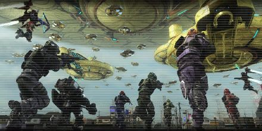{ .off-glb loading=lazy }](no_11.md)
</figure>

## 111. The Nameless

<figure markdown>
  [{ .off-glb loading=lazy }](the_nameless.md)
</figure>
